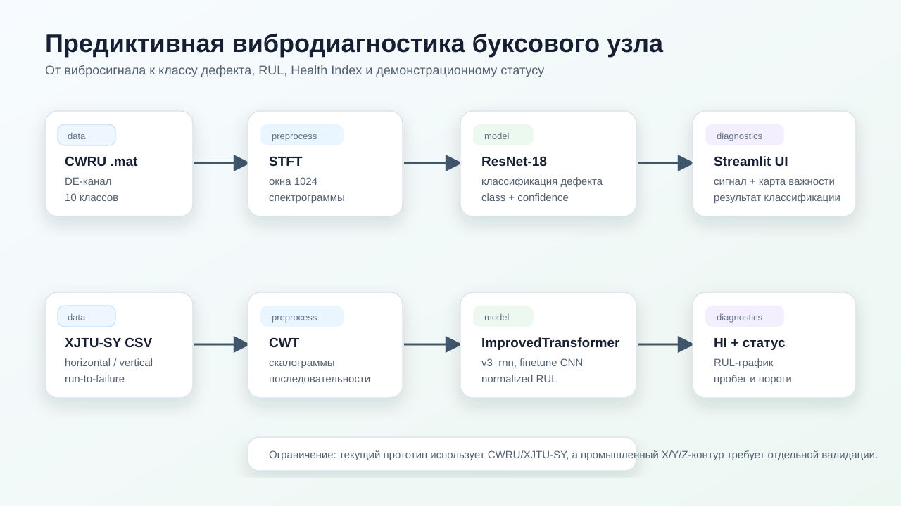
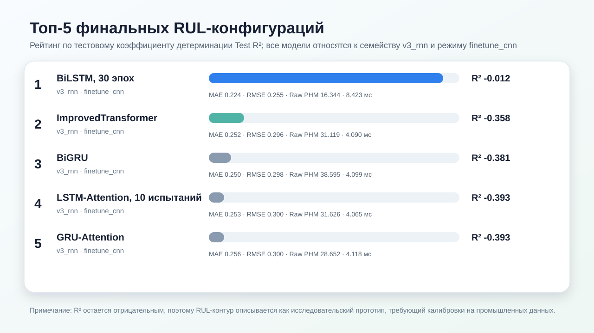
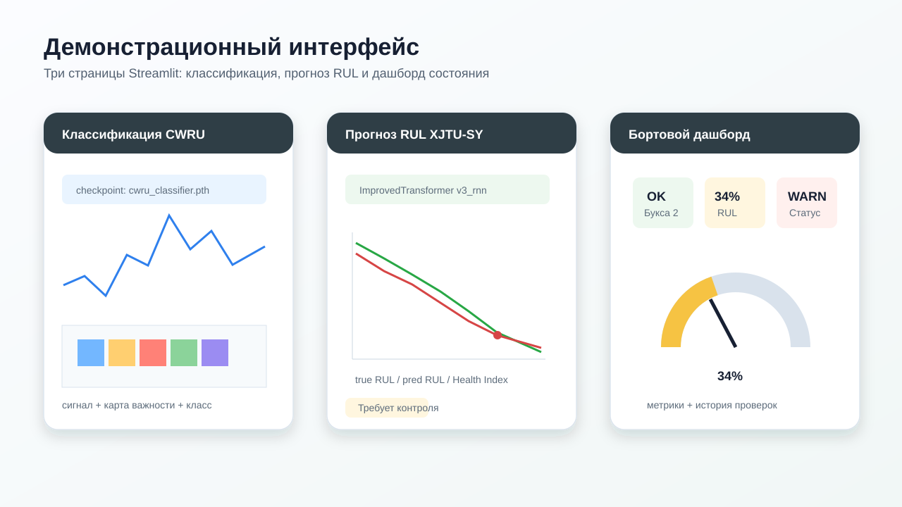
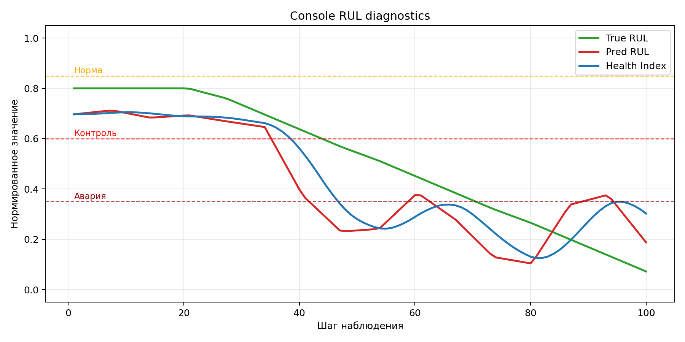

# wheelset-vibration-analytics

Исследовательский прототип предиктивной диагностики буксовых узлов: классификация дефектов CWRU, прогноз RUL по XJTU-SY и Streamlit-демо.

## Что внутри

- **CWRU:** STFT + ResNet-18 для классификации дефектов подшипника.
- **XJTU-SY:** CNN + temporal-модель для прогноза нормированного RUL.
- **Демо:** Streamlit и Plotly с инференсом сохранённых checkpoint.









## Структура проекта

- app.py — Streamlit-демо.
- src — ML, признаки, инференс и визуализация.
- tests — pytest.
- data и models — датасеты, кэш и checkpoint.
- experiments и scripts — исследовательские запуски.
- reports — рисунки, таблицы и логи.
- console_diagnostics — CLI-диагностика.
- pyproject.toml, uv.lock и Makefile — окружение и команды.
- .github/workflows/tests.yml — CI.

## Топ-5 RUL-моделей

Лучшие финальные конфигурации прогнозирования RUL по тестовому `R²` (таблица 13).

| № | Модель | Семейство | Режим | Test R² | MAE | RMSE | Raw PHM | Задержка, мс |
|---:|---|---|---|---:|---:|---:|---:|---:|
| 1 | BiLSTM, 30 эпох | v3_rnn | finetune_cnn | -0,012 | 0,224 | 0,255 | 16,344 | 8,423 |
| 2 | ImprovedTransformer | v3_rnn | finetune_cnn | -0,358 | 0,252 | 0,296 | 31,119 | 4,090 |
| 3 | BiGRU | v3_rnn | finetune_cnn | -0,381 | 0,250 | 0,298 | 38,595 | 4,099 |
| 4 | LSTM-Attention, 10 испытаний | v3_rnn | finetune_cnn | -0,393 | 0,253 | 0,300 | 31,626 | 4,065 |
| 5 | GRU-Attention | v3_rnn | finetune_cnn | -0,393 | 0,256 | 0,300 | 28,652 | 4,118 |

> Все значения `R²` отрицательные, поэтому результаты RUL следует трактовать как исследовательский baseline/прототип, а не как промышленно валидированную модель остаточного пробега.

## Демо

Три экрана: классификация CWRU, прогноз RUL XJTU-SY и демонстрационный бортовой дашборд. ML-логика находится в `src/prediction/demo_inference.py`, UI — в `app.py`.

```bash
make docker-build
make docker-run-demo       # http://localhost:8501
```

Без Docker:

```bash
python -m pip install uv
make demo
```

Режим `demo` показывает отобранные модели из `models/demo_best/`; `experimental` добавляет совместимые исследовательские checkpoint:

```bash
make docker-run-experimental
```

Каталог и активные модели можно переопределить переменными `DEMO_MODELS_DIR`, `CWRU_CLASSIFIER_CHECKPOINT` и `XJTU_RUL_CHECKPOINT`.

## Окружение и документы

Полное ML-окружение описано в `pyproject.toml` и зафиксировано в `uv.lock`:

```bash
python -m pip install uv
make install              # uv sync --dev
```

`requirements.txt` используется упрощённым запуском демо и Docker. Материалы для защиты: [паспорт данных](DATA_PASSPORT.md) и [сценарий демонстрации](DEMO_SCENARIO.md).

## Тесты и CI

Быстрый набор не обучает модели и не требует checkpoint или датасетов:

```bash
uv sync --locked --dev
uv run pytest -m "not slow" -q
```

Текущий результат: **76 passed, 4 deselected**, покрытие `src` и `console_diagnostics` — **80%**. Для coverage:

```bash
uv run pytest -m "not slow" --cov=src --cov=console_diagnostics --cov-report=term -q
```

GitHub Actions запускает этот набор для pull request и push в `develop`/`main`. Sparse checkout исключает тяжёлые `models/` и `data/`; зависящие от них тесты помечены `slow`. Полная локальная release-проверка:

```bash
make check
```

## Материалы для ВКР

Таблицы и рисунки собираются из сохранённых `summary_metrics*.csv` без повторного обучения:

```bash
make vkr-materials
```

Результаты сохраняются в `reports/tables_for_vkr/` и `reports/figures/summary/`. Дополнительные параметры доступны через `uv run python scratch_scripts/make_vkr_materials.py --help`.

## Данные

- `data/raw/CWRU/` — `.mat`-сигналы DE-канала для классификации.
- `data/raw/XJTU-SY/` — run-to-failure CSV с горизонтальным и вертикальным каналами для RUL.
- `data/cache/` — CWT-скалограммы и CNN-признаки.

Источники, preprocessing, split и ограничения описаны в [DATA_PASSPORT.md](DATA_PASSPORT.md).

## Обучение и эксперименты

```bash
uv run python src/classification/train.py   # CWRU
uv run python src/prediction/train.py       # базовый RUL + Optuna
./scripts/run_all_hybrids_overnight.sh      # гибридные семейства
make mlflow                                 # http://localhost:5000
```

Профиль `fast` предназначен для sanity-check, `balanced` — для основных сравнений. Отдельные entrypoint для v2, v3 RNN, v4 TCN и v5 experimental находятся в `src/prediction/`; готовые сценарии — в `scripts/`.

## Модели и артефакты

- `models/demo_best/` — модели, доступные в основном демо.
- `models/cnn/` и `models/pred*` — классификационные и исследовательские RUL checkpoint.
- `reports/` — метрики, таблицы, графики и логи.

Чтобы заменить модель демо, положите checkpoint в `models/demo_best/classification/` или `models/demo_best/rul/` и обновите default в `src/prediction/demo_inference.py`. Для временного выбора используйте `CWRU_CLASSIFIER_CHECKPOINT` или `XJTU_RUL_CHECKPOINT`.

## Ограничения

- Это исследовательский прототип, а не промышленная система online monitoring.
- CWRU и XJTU-SY описывают подшипники, но не полный набор дефектов колёсной пары.
- Демо работает с подготовленными сигналами и не принимает пользовательские файлы.
- Карта важности — gradient × input, не SHAP.
- RUL в километрах — демонстрационная постобработка Health Index, а не валидированная физическая модель.
- Дашборд использует mock-историю без БД, пользователей, API и аудита решений.
- Одна выбранная RUL-модель не даёт ансамблевого доверительного интервала.
